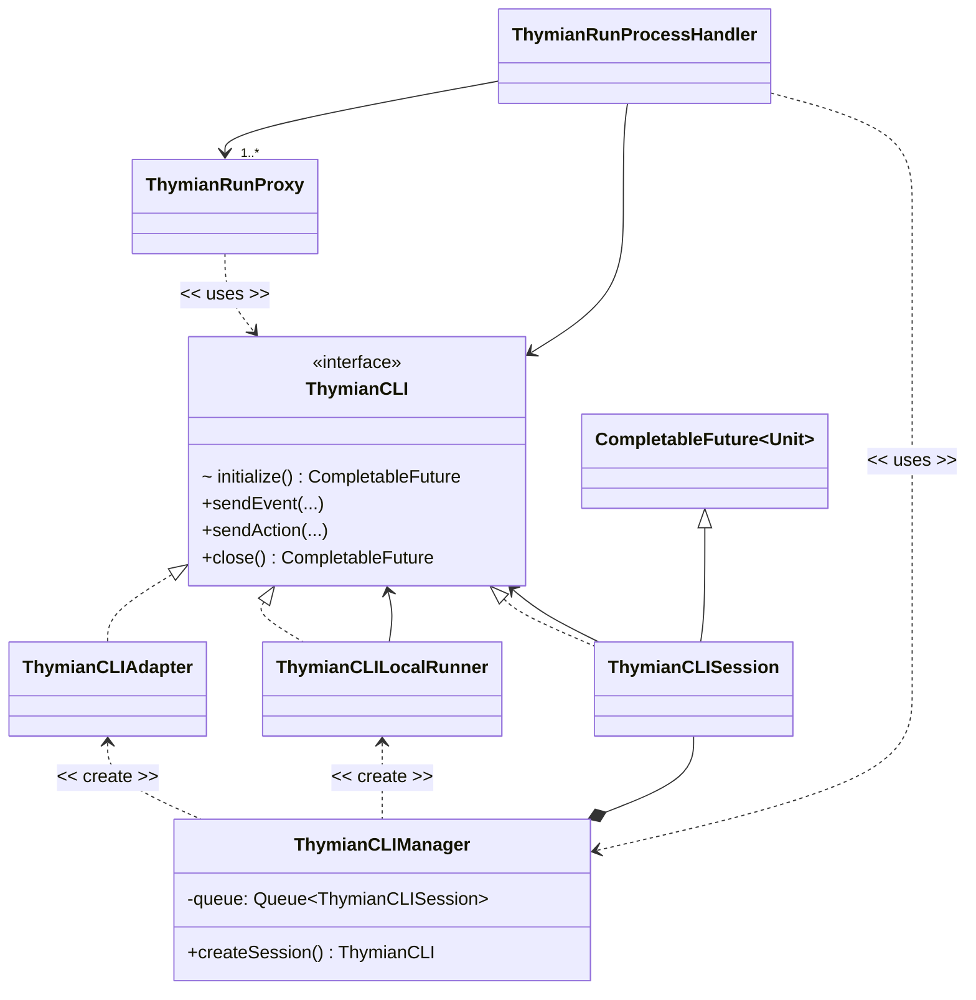

# Test Run

```mermaid
classDiagram
    class ThymianRunProcessHandler
    class ThymianRunProxy
    class ThymianCLIManager {
        -queue: Queue~ThymianCLISession~
        +createSession() ThymianCLI
    }
    class ThymianCLI {
        ~ initialize() CompletableFuture
        +sendEvent(...)
        +sendAction(...)
        +close() CompletableFuture
    }
    <<interface>> ThymianCLI
    class ThymianCLIAdapter
    class ThymianCLILocalRunner
    class ThymianCLISession
    class CompletableFuture~Unit~
    ThymianCLI <|.. ThymianCLIAdapter
    ThymianCLI <|.. ThymianCLILocalRunner
    ThymianCLI <-- ThymianCLILocalRunner
    ThymianCLI <|.. ThymianCLISession
    ThymianCLI <-- ThymianCLISession
    CompletableFuture <|-- ThymianCLISession
    ThymianCLIAdapter <.. ThymianCLIManager: << create >>
    ThymianCLILocalRunner <.. ThymianCLIManager: << create >>
    ThymianCLISession --* ThymianCLIManager
    ThymianRunProcessHandler ..> ThymianCLIManager: << uses >>
    ThymianRunProcessHandler --> "1..*" ThymianRunProxy
    ThymianRunProxy ..> ThymianCLI: << uses >>
    ThymianRunProcessHandler --> ThymianCLI
```